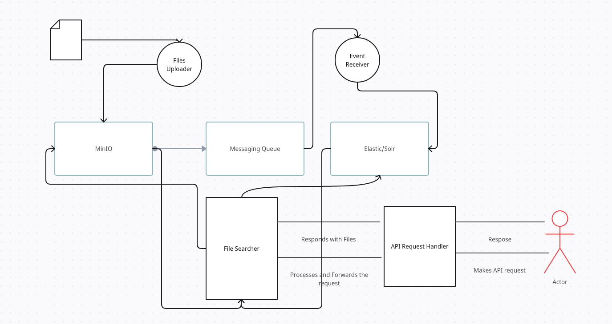
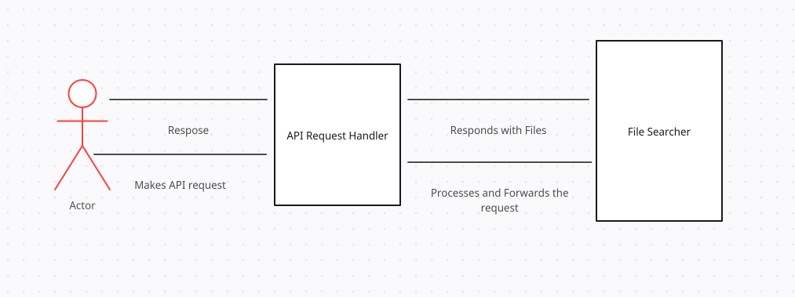

 

 <h1 style="text-align: center;">Software Requirements & Design Specification    for     MinIO Data Search     </h1> 

 
 
 
 
 
 

 <h3 style="text-align: center;"> Project Category : Data Search </h3> 

 
 
 
 
 
 

 <h2 style="text-align: center;"> Team Members : </h2> 

 <h3 style="text-align: center;"> Hari Krishnan U M - 2021202022 </h3> 

 <h3 style="text-align: center;"> Manu Gupta - 2021202025 </h3> 

 <h3 style="text-align: center;"> Shaon Dasgupta - 2021201068 </h3> 

 
 

<h1>Table of Content :</h1>

<h2> Software Requirements </h2>

1. [ Introduction. ](#intro)
2. [ Overall Description. ](#desc)
3. [ System Features. ](#feat)
4. [ Non Functional Requirements. ](#nonfunc)

<h2> Design Specification </h2>

1. [ High Level Design. ](#hld)
2. [ Proposed Design. ](#pd)
3. [ High Level API. ](#hla)

 

 

<h1>Software Requirements</h1>

## 1. Introduction

...

## 2. Overall Description

...

## 3. System Features

...

## 4. Non Functional Requirements

...

 

 
<h1>Design Specification</h1>

## 1. High Level Design

On a high level the design consists of mainly 2 workflows:
- DataSets Upload: Uploader will upload data to MinIO, as data is uploaded, an event will be triggered and added to a Messaging Queue, There will be an event listener which will then take data from the MQ and add it to Elastic Search or Solr service for future queries.
- When an API call is made by the user, it will first go to API handler where the processing of query will take place, it will then forward the request to File Searcher which will then communicate with Elastic Search to get the Object IDs, which can then be used to fetch data from MinIO. It will then return the result from MinIO to the API handler and finally to end user. 

## 3. High Level API

The API will consist of a main endpoint:
- /query : The body of the query should consist of access token (if required), information about the category of images, fine grained filters (if any), any other misc. information required to process the query

